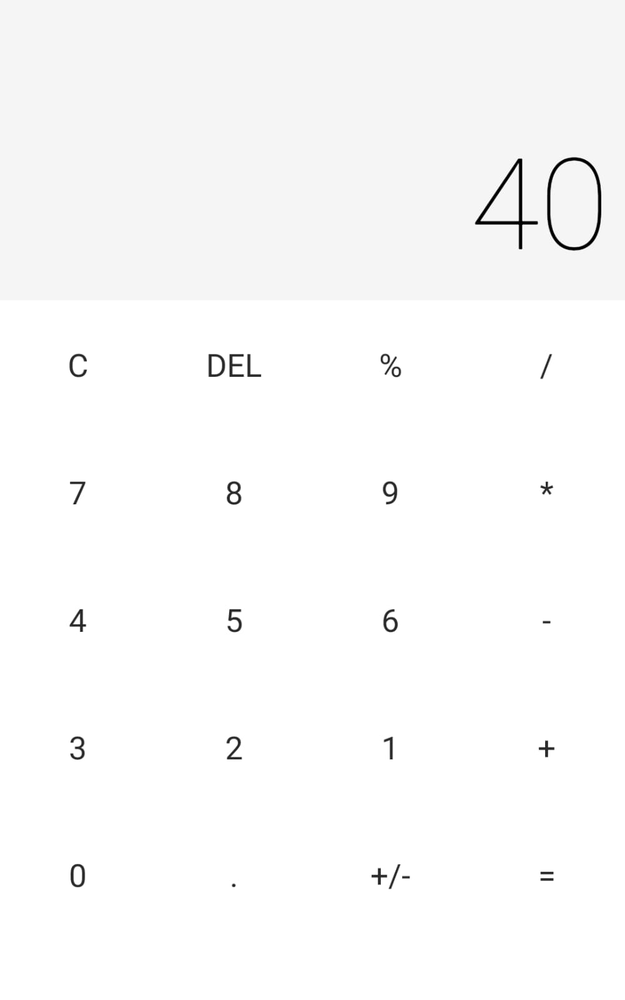

# Calculadora React Native

Este é um projeto de uma calculadora simples desenvolvida em React Native utilizando o Expo Go para execução.



## Tecnologias Utilizadas

- `React Native`
- `Expo Go`
- `TypeScript`
- `Styled Components` (opcional)

## Pré-requisitos

Antes de iniciar, certifique-se de ter instalado:

- [`Node.js`](https://nodejs.org/)
- [`Expo CLI`](https://docs.expo.dev/get-started/installation/)
- Um emulador `Android/iOS` configurado ou o aplicativo `Expo Go` no seu dispositivo móvel

## Instalação

1. Clone este repositório:
   ```bash
   git clone https://github.com/KelvinGuimaraes/calculadora-ReactNative.git
2. Acesse a pasta do projeto:
    ```bash
    cd calculadora-react-native
3. Instale as dependências:
    ```bash
    npm install
    # ou
    yarn install
# Executando o Projeto
 
1. Inicie o servidor Expo:
    ```bash
    npm start
    # ou
    npx expo start
2. No terminal, escolha como deseja rodar o aplicativo:

- Escaneie o QR Code com o Expo Go (Android/iOS)

- Pressione "a" para abrir no emulador Android

- Pressione "i" para abrir no simulador iOS (apenas em macOS)

## Funcionalidades
- Operações básicas: soma, subtração, multiplicação e divisão

- Interface intuitiva e responsiva

- Suporte a modo claro e escuro (se implementado)

### Licença
Este projeto está sob a licença MIT. Sinta-se à vontade para utilizá-lo e modificá-lo conforme necessário.

Desenvolvido por [KELVIN GUIMARÃES MELO](https://github.com/KelvinGuimaraes)